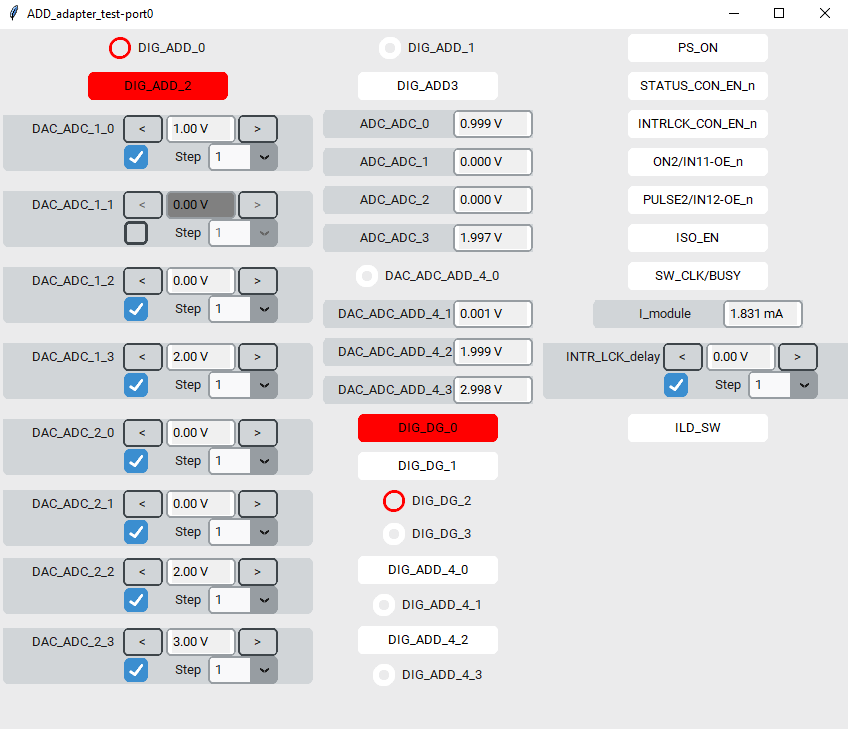
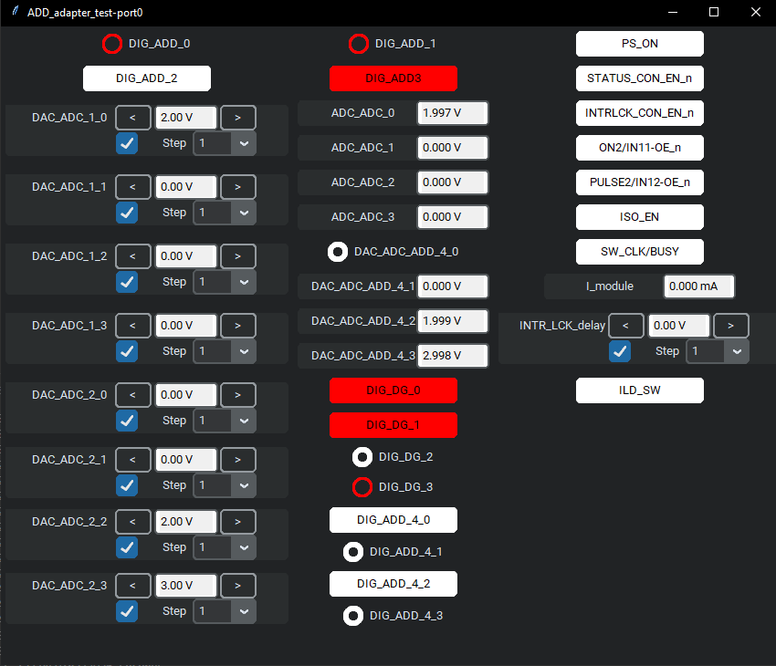

## Using the FLC interface program

Before using, be sure that you have installed all of the Python modules listed in `requirements.txt` or `requirements_rpi.txt`
The required Python version is 3.10.6

The program needs a `port_settings.yaml` file to run. In this file you have to configure:
- **ports and their Excel set-files**
        *Example command:*  `port0: 'ADD_adapter_test.xlsm'`
        `port0 ` - means that you will be communicating to the port number 0 on FLC interface
        `'ADD_adapter_test.xlsm'` - is the name of the Excel file used to set the port (has to be in the same directory)

        Note: Maximum number of ports should be 2 on Windows (on Raspberry Pi 1) for most optimal performance.

- **dark mode (optional)**
        *Example command:*  `darkmode: True`
        If you want your program to run in the dark mode, set it to `True`. Default value is `False`.

For more information on how to set the `port_settings.yaml` look at the `example.port_settings.yaml`.

Once you correctly set the `port_settings.yaml` file, you can run the program.
A window should pop open after approximately 5-10 seconds. If you haven't enabled the dark mode, the window should look like this:

If you enabled the dark mode, the window should look like this:
